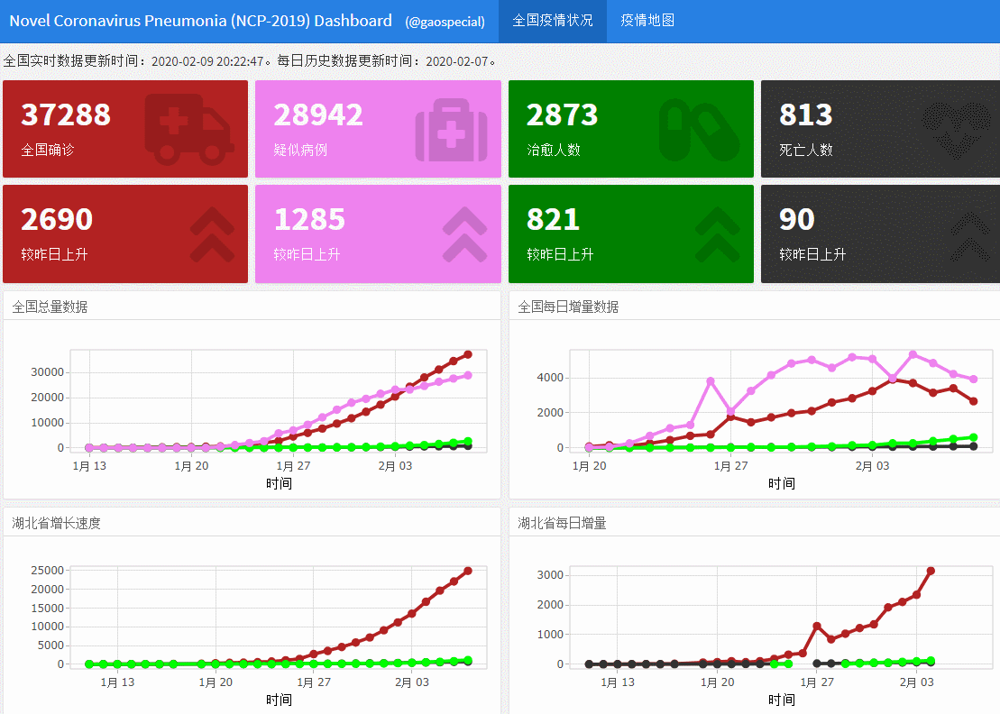

# NCPdashboard
Novel Coronavirus Pneumonia (NCP-2019) Dashboard

感谢 [@GuangchuangYu](https://github.com/guangchuangyu) 的 [nCov2019](https://github.com/guangchuangyu/nCov2019) 包和 [@一棵树](https://github.com/yikeshu0611) 的新版中国地图数据。

数据来源：[腾讯新闻：新型冠状病毒肺炎疫情追踪](https://news.qq.com/zt2020/page/feiyan.htm)

# 使用演示

# 访问地址

http://bio-spring.info:2020/nCov-dashboard.Rmd

（感谢 [@徐洲更](https://github.com/xuzhougeng) 提供的 Shiny 服务器）

# 说明

本项目是仓促之间开发的一个工具，目前缺乏维护，请不要借此工具查询相关信息。

如果想要部署到自己的服务器上，可以进行下列操作。

- clone到服务器上面。
- 安装较新版本的R、所有依赖的包，以及包依赖的库文件。根据我的经历，`library(sf)` 的一些依赖可能会报错，主要原因是缺乏相应的库文件，如 `classInt`，可以参见这里的解决方法：https://r.bio-spring.info/2020/02/10/install-sf-classint/  。
- 在Linux终端运行命令：
  
  `nohup R -e 'rmarkdown::run("nCov-dashboard.Rmd",shiny_args = list(launch.browser=FALSE,host="111.111.111.111",port=2020))'   > log 2>&1  &`
  
  这个命令将在后台运行一个服务，其中 111.111.111.111 是你服务器的IP地址，2020 是端口。运行成功后可以通过 `your-domain.com:2020/nCov-dashboard.Rmd` 访问到。
